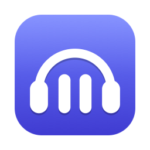

<p align="center">
  
</p>

# BeQuiet

A small macOS menu bar utility that pauses media playback whenever the
microphone becomes active — a call in Teams, a Slack huddle, Google Meet in a
browser tab — and resumes it once the microphone goes idle again. macOS 14+,
Swift, no external dependencies.

## What it does

- Pauses Spotify, Apple Music and playing media in Google Chrome and Safari
  tabs when a call starts.
- Resumes exactly what it paused itself, once the microphone has been idle for
  a few seconds.
- Ignores short microphone bursts (dictation, Siri) through a debounce delay.
- Survives brief drop-outs mid-call (reconnects, audio device switches) without
  resuming playback.
- Leaves media the user starts *during* a call alone: while the microphone is
  active nothing is scanned or paused.
- Lives in the menu bar only — no Dock icon, no windows, no settings sheet.

## How detection works

BeQuiet asks CoreAudio which processes are currently *running input*
(`kAudioHardwarePropertyProcessObjectList`, macOS 14+). The microphone counts
as active as soon as any process other than BeQuiet reports input.

- No microphone permission is needed and no audio is ever captured — only
  device and process state is read.
- It works for *any* application, without knowing the meeting apps: Teams,
  Slack, Zoom, FaceTime, a Meet tab in Chrome all look the same from here.
- Device-level state (`kAudioDevicePropertyDeviceIsRunningSomewhere`) is used
  only to re-evaluate the process list, because a bidirectional device
  (AirPods, USB headset) reports as running while it merely plays audio. It
  serves as a fallback if the process list cannot be read at all.

## Requirements

- macOS 14 (Sonoma) or newer.
- Xcode Command Line Tools to build (`xcode-select --install`).

## Install

### Homebrew

```sh
brew install --no-quarantine petrnymsa/tap/bequiet
open /Applications/BeQuiet.app
```

`--no-quarantine` matters: the build is ad-hoc signed and not notarized, and
Homebrew quarantines cask downloads by default, so without the flag Gatekeeper
refuses to open the app. Upgrades work the same way
(`brew upgrade --no-quarantine bequiet`), or set
`HOMEBREW_CASK_OPTS=--no-quarantine` once in your shell profile.

### From source

```sh
git clone https://github.com/petrnymsa/be_quiet.git
cd be_quiet
make install
open /Applications/BeQuiet.app
```

`make install` builds a release binary, assembles `dist/BeQuiet.app`, signs it
ad-hoc and copies it to `/Applications`. A locally built copy is never
quarantined, so no flag is needed.

### First launch

BeQuiet sits in the menu bar; it has no Dock icon and no main window.

On the first launch macOS asks for permission to control Spotify, Music, Google
Chrome and Safari — one prompt per application that is running at the time.
BeQuiet warms the controllers up at startup precisely so the prompts appear
right away instead of in the middle of a call. They have to be allowed; the
answers can be changed later under System Settings → Privacy & Security →
Automation.

The signature is ad-hoc (there is no paid Developer account), and its identity
changes with every rebuild, so macOS treats each rebuild as a new application
and asks again. To clean up the accumulated answers:

```sh
tccutil reset AppleEvents cz.nymsa.BeQuiet
```

## Browser setup

Neither browser exposes an "is this tab playing audio" property to AppleScript,
so BeQuiet asks every tab through JavaScript. That takes one setting per
browser:

- **Google Chrome**
  - *View → Developer → Allow JavaScript from Apple Events*
- **Safari**
  - *Settings → Advanced → Show features for web developers*, which adds the
    Develop menu
  - *Develop → Allow JavaScript from Apple Events*

In Chrome the menu item is a per-profile setting, so it has to be switched on
in every profile whose tabs should be paused. Without the setting the browser
refuses every script — Chrome with *"Executing JavaScript through AppleScript
is turned off"*, Safari with *"You must enable 'Allow JavaScript from Apple
Events' in the Developer section of Safari Settings"* — and BeQuiet shows a
warning under the browser's own menu item and pauses nothing.

The first time BeQuiet sends an Apple Event to a browser, macOS shows the
one-time Automation prompt described above. When the CLI is used from a
terminal, the prompt names the terminal application rather than BeQuiet, because
that is the process sending the event.

## User guide

BeQuiet has no window. Everything happens in the menu bar icon and its menu.

### The icon

|  |  |  |
|:--|:--|:--|
| **Listening.** Nothing is paused. Drawn dimmed while BeQuiet is disabled. | **Armed.** The microphone just became active and the debounce is running — or the call just ended and the resume delay is running. | **Paused.** BeQuiet has paused media and is holding it. Hover for the list. |

The icon is a template image, so it follows the light and dark menu bar.

### The menu

| item | meaning |
|---|---|
| first line | current state: `Idle`, `Microphone in use by Microsoft Teams`, `Paused: Spotify, Google Chrome`, `Resuming shortly…`, `Disabled` |
| `Enabled` | master switch; switching it off resumes anything BeQuiet holds |
| `Pause Spotify` | whether Spotify is paused during calls |
| `Pause Apple Music` | whether the Music app is paused during calls |
| `Pause Google Chrome` | whether playing Chrome tabs are paused during calls |
| `Pause Safari` | whether playing Safari tabs are paused during calls |
| `⚠︎ Allow JavaScript from Apple Events is off …` | shown while a browser refuses scripting; see *Browser setup* |
| `Ignored apps ▸` | applications whose microphone use is not a call: everything holding the microphone right now, ticked when ignored, plus the entries that are ignored but not running |
| `Debounce ▸` | how long the microphone must stay active before media is paused (0.5–5 s) |
| `Resume delay ▸` | how long the microphone must stay idle before media is resumed (1–10 s) |
| `Launch at Login` | register BeQuiet as a login item; see below |
| `Quit BeQuiet` | resumes anything BeQuiet paused, then exits |

### A typical call

1. Spotify plays, a YouTube tab plays in Chrome. The icon shows *Listening*.
2. You join a Meet or Teams call. The icon switches to *Armed* and, once the
   microphone has been active for the debounce time (2 s by default), to
   *Paused*: Spotify and the YouTube tab stop. The menu reads
   `Paused: Spotify, Google Chrome`.
3. Someone drops and rejoins, your headset reconnects, you switch to AirPods —
   the microphone goes off and on for a moment. The icon flickers to *Armed*
   and back; nothing resumes, because the resume delay (3 s) absorbs the gap.
4. You hang up. After the resume delay Spotify and the tab play again. Only
   what BeQuiet paused comes back: Spotify you paused yourself before the call
   stays paused, and anything you started during the call is left alone.

### Tips

- Dictation, Siri or a quick voice note is shorter than the debounce and does
  not pause anything. If it still does on your machine, raise `Debounce`.
- Calls that reconnect often: raise `Resume delay`.
- Music during a call is fine — press play; BeQuiet never touches media you
  start while the microphone is active.
- Media *in* the call — Meet's participants, a shared screen with sound — is a
  live stream and is never paused.
- Virtual machines, the Android Emulator and audio tools hold the microphone
  for their whole lifetime, without any call: to macOS they look exactly like
  Teams. Open `Ignored apps ▸` while one of them runs and tick it; the
  Android Emulator (`qemu-system-aarch64`) is ignored out of the box.
- The first line of the menu says `Idle — ignoring qemu-system-aarch64` while
  an ignored application holds the microphone, so a running emulator never
  looks like a missed call.

## Launch at Login

`Launch at Login` uses `SMAppService`, which registers the *application
bundle*. It is therefore only available when BeQuiet runs from
`/Applications/BeQuiet.app` — the item is disabled for a binary started with
`swift run`.

macOS may put the new login item on hold; the menu item then reads
*Launch at Login (approve in System Settings)* and opens
System Settings → General → Login Items, where BeQuiet has to be switched on.

## Advanced settings

Everything the menu offers is stored in `UserDefaults` under the bundle ID, and
values outside the menu presets can be set by hand:

```sh
defaults write cz.nymsa.BeQuiet debounceSeconds -float 1.5
defaults write cz.nymsa.BeQuiet ignoredProcesses -array qemu-system-aarch64 com.utmapp.UTM
```

| key | type | default |
|---|---|---|
| `enabled` | Bool | `true` |
| `debounceSeconds` | Double | `2` |
| `resumeDelaySeconds` | Double | `3` |
| `controller.spotify` | Bool | `true` |
| `controller.appleMusic` | Bool | `true` |
| `controller.chrome:com.google.Chrome` | Bool | `true` |
| `controller.safari` | Bool | `true` |
| `ignoredProcesses` | [String] | `qemu-system-aarch64`, `qemu-system-x86_64` and their `-headless` variants |

BeQuiet reads the settings at startup, so it has to be restarted afterwards. A
value that matches no preset shows up in the submenu as `Custom: 1.5 s`.

An entry of `ignoredProcesses` is a bundle ID, or the executable name for a
process that has none — `bequiet watch` prints the name it uses for every
process. An empty array means nothing is ignored; the defaults come back only
when the key is removed (`defaults delete cz.nymsa.BeQuiet ignoredProcesses`).

## Debugging

The `bequiet` CLI is the debugging aid for the same pipeline:

```sh
swift run bequiet watch                 # microphone snapshot + every change
swift run bequiet run                   # the full pipeline with a log line per transition
swift run bequiet controller spotify    # pause and resume one controller by hand
swift run bequiet controller music
swift run bequiet controller chrome
swift run bequiet controller safari
```

`watch` and `run` take `--ignore <bundle ID or executable name>`, repeatable,
which adds to the ignore list for that run only — the quick way to check
whether a process that holds the microphone belongs on the list. Ignored
processes are marked `input=1 (ignored)`.

Both the app and the CLI log to the unified log:

```sh
log stream --predicate 'subsystem == "cz.nymsa.BeQuiet"' --level debug
```

Categories are `mic`, `coordinator`, `player`, `browser` and `app`.

## Known limitations

- **Media inside cross-origin iframes is invisible.** The script runs in the
  top document only, so embedded players (a YouTube or Spotify embed on a
  third-party page, most ad players) are neither found nor paused.
- **Resuming can be refused by the browser's autoplay policy.** `play()` from
  an Apple Event has no user activation behind it, so the browser may reject it
  on pages the user has not interacted with. Nothing is broken, the tab simply
  stays paused.
- **Only Chrome and Safari are enabled.** Brave, Arc, Microsoft Edge and
  Chromium share Chrome's scripting dictionary, and Chromium-based browsers
  other than Chrome can be added with
  `BrowserController(bundleID:dialect:)`, but there is no user interface for
  adding them yet.
- **Media started during a call is left alone**, by design: while the
  microphone is active nothing is scanned or paused.
- **Gatekeeper stops a downloaded build.** The zip from `make dist` carries no
  notarization, so a downloaded copy has to be allowed under System Settings →
  Privacy & Security → *Open Anyway*, or unquarantined by hand:
  `xattr -dr com.apple.quarantine /Applications/BeQuiet.app`. A locally built
  copy is never quarantined and needs neither.

## Development

```sh
swift build          # everything, debug
swift test           # coordinator, settings, snapshot rules, browser scripting, presentation
make app             # dist/BeQuiet.app, current architecture, ad-hoc signed
make install         # the same, copied to /Applications
make dist            # universal (arm64 + x86_64) dist/BeQuiet-<version>.zip
make docs-images     # regenerate the README images from the SVG sources
make clean
```

### Releasing

1. On `dev`: bump `VERSION` in the `Makefile`, add the section to
   `CHANGELOG.md`, commit (`release: v0.2.0`), merge into `main`.
2. On `main`: `make release` — builds the universal zip, tags `v<version>`,
   pushes and creates the GitHub release with the changelog section as notes.
3. `make publish-cask` — writes the cask with the zip's checksum into a
   sibling checkout of [`petrnymsa/homebrew-tap`](https://github.com/petrnymsa/homebrew-tap)
   (`TAP_DIR`, default `../homebrew-tap`) and pushes it.

```
Sources/
  MicMonitor/     CoreAudio microphone detection, no AppKit
  MediaControl/   MediaController protocol, players (Spotify, Apple Music), browsers (Chromium, Safari)
  BeQuietCore/    PauseStateMachine, PauseCoordinator, Settings
  BeQuietCLI/     `bequiet` — the debugging CLI
  BeQuiet/        the menu bar app (status item, menu, icon, launch at login)
Tests/            state machine, coordinator, settings, snapshot rules, scripting, presentation
Packaging/
  Info.plist      template for the app bundle
  bequiet.rb      Homebrew cask template (version and checksum filled in by `make cask`)
  Icons/          the SVG sources: AppIcon.svg (1024 squircle), MenuBarIcon.svg (18 pt template)
  make-icons.swift  renders AppIcon.svg to BeQuiet.icns and the README images with AppKit alone
docs/
  DESIGN.md       architecture, detection findings, decisions
  images/         generated by `make docs-images`
Makefile          release build → BeQuiet.app → ad-hoc signature
```

The menu bar glyph is built in code (`MenuBarIcon`) from the same SVG shapes,
so the three states — pause bars present, faded or absent — need no extra
assets and no resource bundle.

The app is built as the `BeQuietApp` product and installed as `BeQuiet.app`:
two executable products whose names differ only in case (`BeQuiet` and
`bequiet`) cannot coexist in the build directory on a case-insensitive
filesystem.
